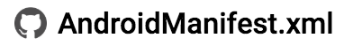

# Master Sample GDoc Codelab

[Codelab Feedback](https://groups.google.com/a/google.com/forum/#!forum/codelab-authors)


## Introductory Step
Duration: 04:00


### What you'll learn

* How to create awesome looking Codelabs


## Lists
Duration: 04:00


### Subheading

1. Numbered/Ordered
2. List

* Unordered
* Nested?
* List
* Nested?

#### More subheadings? Prob need deserves another step :D


## Code
Duration: 03:00


`Inline Code`

Unhighlighted block text - `Consolas` Text on a single-cell table. Non-font styling ignored. Good for console outputs and command usages.

    $ adb devices          # list to see your device
    $ adb root             # switch to root user
    $ adb shell            # enter adb shell

    kubectl get pods
    
    NAME                  READY   STATUS     RESTARTS   AGE
    Example-build-2vj4r   0/1     Init:2/3   0          15s

Asides/Callouts

<aside class="">**NOTE:** This is a note</aside>

<aside class="">**Important****:** This is a warning note</aside>

Highlighted Code Snippet - `Courier New` text on a single-cell table. Non-font styling ignored. Language agnostic  *per table* . [TODO describe code_location]

```
<activity android:name="com.recipe_app.client.RecipeActivity"
         android:label="@string/title_gizmos" >
   <intent-filter android:label="@string/filter_title_viewrecipe">
       <action android:name="android.intent.action.VIEW" />
       <!-- URIs that begin with "http://recipe-app.com/recipe" -->
       <data android:scheme="http"
             android:host="recipe-app.com"
             android:pathPrefix="/recipe" />
       <category android:name="android.intent.category.DEFAULT" />
       <category android:name="android.intent.category.BROWSABLE" />
   </intent-filter>
</activity>
```

```
def main(Mapping[Any] unused_args):
  print("{}".format("".join(["e", "t"])))
```


## Buttons


Links highlighted with **dark green 1 **will show as buttons. If the links start with ‘Download' a download icon ( ) will be shown at the beginning of the button.

[](https://google.dev/playlists)

[](https://github.com/google/search-samples/archive/master.zip)

### GitHub Code Links

**Heading 3** with a link to GitHub gets stylized. The below example will be shown as 

[AndroidManifest.xml](https://github.com/google/search-samples/blob/master/app-indexing/app/src/main/AndroidManifest.xml)

####  [AndroidManifest.xml](https://github.com/google/search-samples/blob/master/app-indexing/app/src/main/AndroidManifest.xml)


## Fragments
Duration: 02:00


Dynamic Content Fragment.

`[[`**`import`**` ` [link to another doc](https://docs.google.com/document/d/1VkJopEKiqitwFgqFOEU6rpB1VE-R-uYWq4erNHP2TQ4/edit)`]]` in a font that's not Consolas nor Courier New.

This is a shared **block **for a  *number*  of codelabs. You should see a funny dog below.


## Size-persistent Centered Images
Duration: 01:00


Images "Alt Text": ⌘+Opt+Y or Right click > "Alt Text...". The  *Title * field will be displayed as the alt-text


## Youtube Videos
Duration: 488:00


Picture with video source in the format `https://www.youtube.com/watch?v=[video_ID]` as alt-text  *Description* 


## TODOs
Duration: 07:00


1. Download buttons
2. Resume codelab?


## Minor Bugs
Duration: 683:00


* Nested lists do not display - WAS?
* When duration disappears due to non-existent or wrongly formatted duration section, it doesn't appear retroactively when browsing BACK to sections with correct ? WAS?
* `class="codelab-time-container"` doesn't **toggle **`style="display: none"` on "Back" navigations, although total time **is **correctly updated
* Negatives are parsed, [too nit/no need] to fix imo
* Only Cloud FAQ Links show as blue. Removing `color: inherit` from `google-codelab:not([theme="minimal"]) .instructions .faq a` fixes it as per Chrome DevTools


## Missing g3 MD => HTML features


* Duration parsing
* Images/YT videos
* **Bold**,  *italics* ?


## The End
Duration: -987:00


### What we've covered

* How to create awesome looking Codelabs

### Frequently Asked Questions

*  [How do I show this thing's true colors?](http://stackoverflow.com)
*  [How do I change the styling of these things?](http://developer.android.com)
*  [How do I know why the cloud links are bluer than the others?](http://cloud.google.com)

Rendered  [Preview](https://codelabs-preview.appspot.com/?file_id=1hLgBuyWTqwNBaZjHDuGR7_3jPLfEuJNISyL_znLU5k8)


## The End


???


